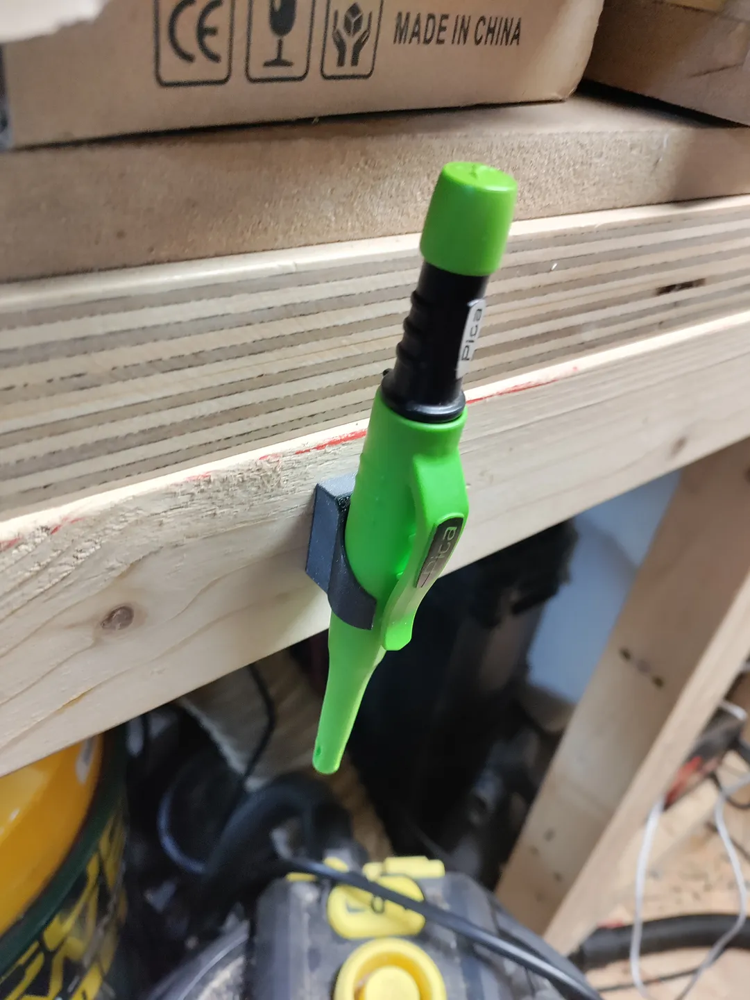
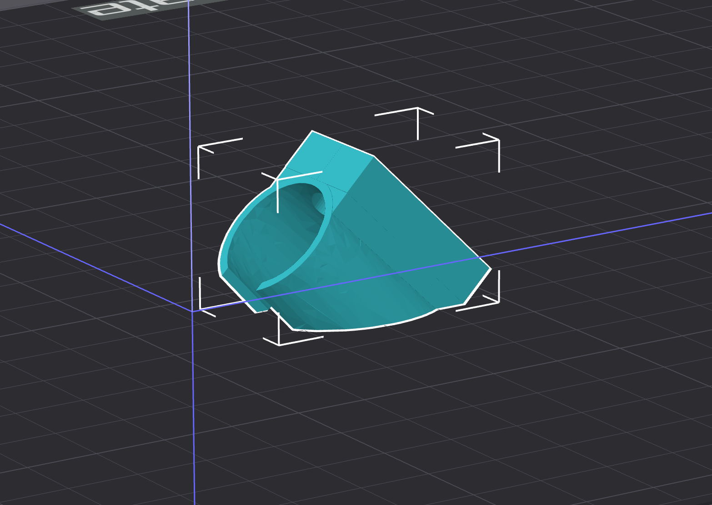
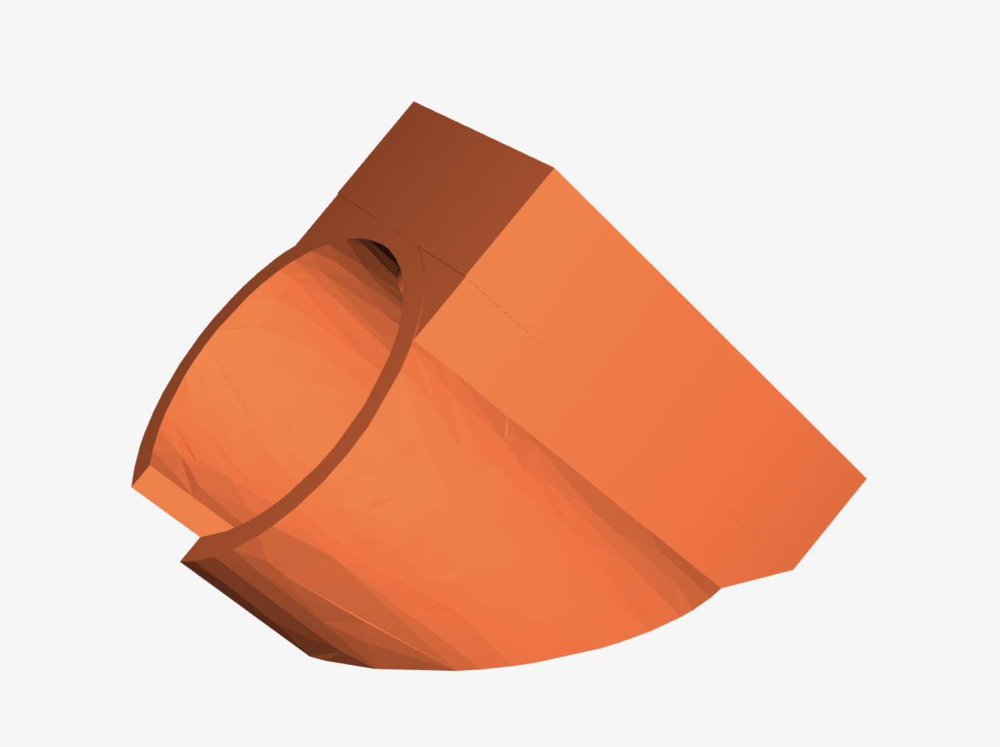
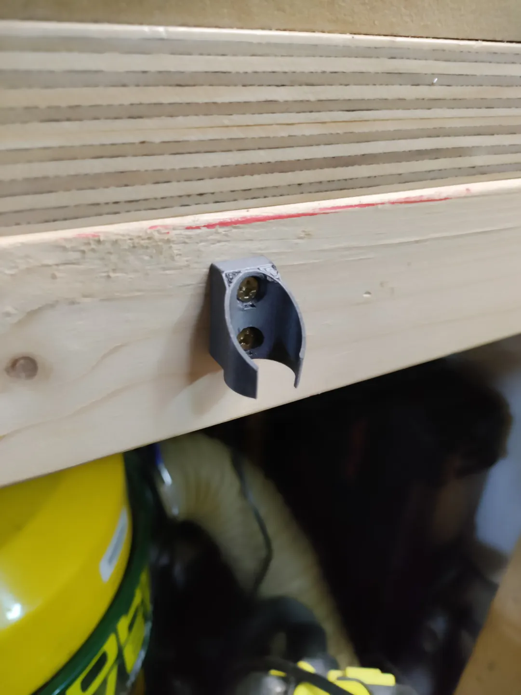
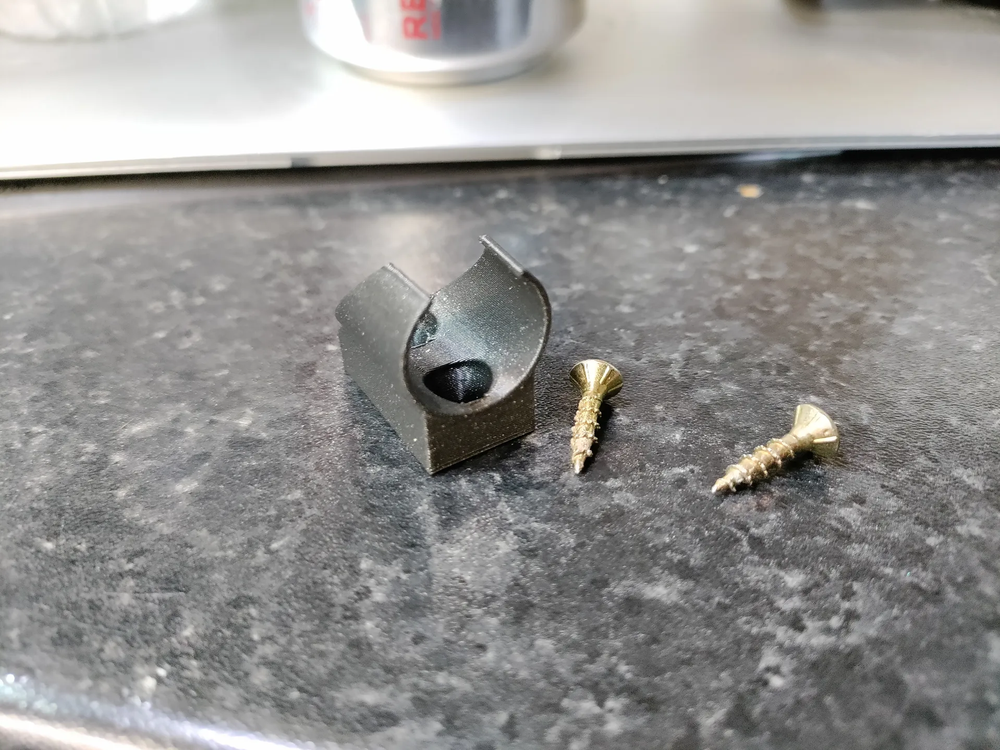
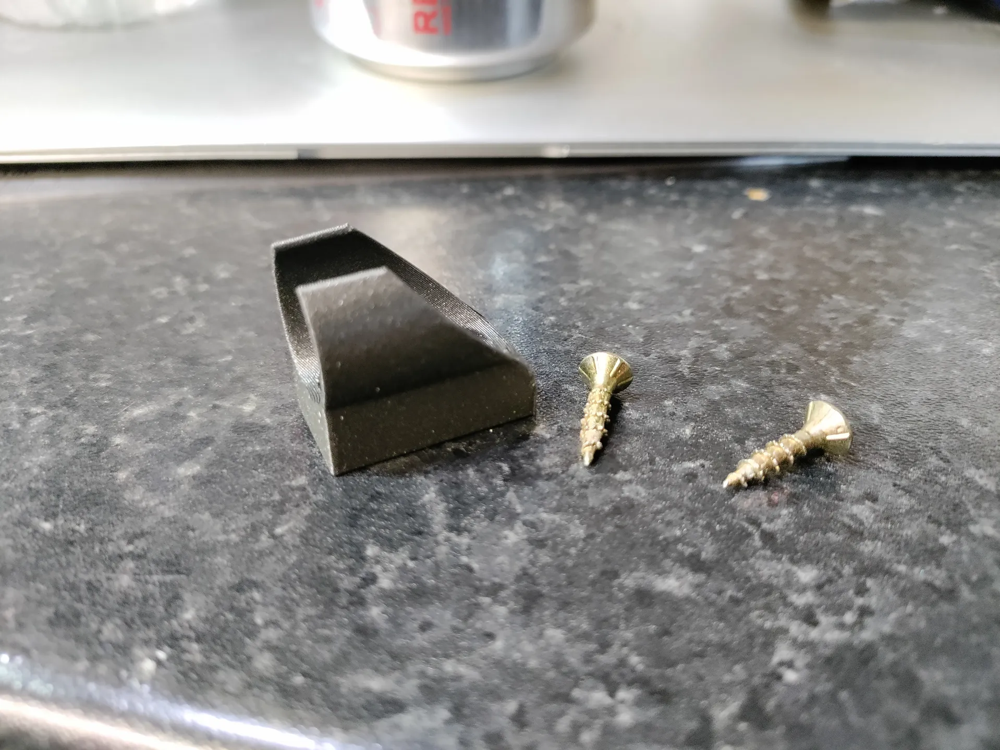
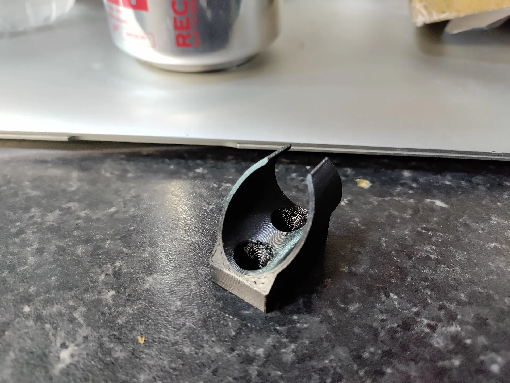
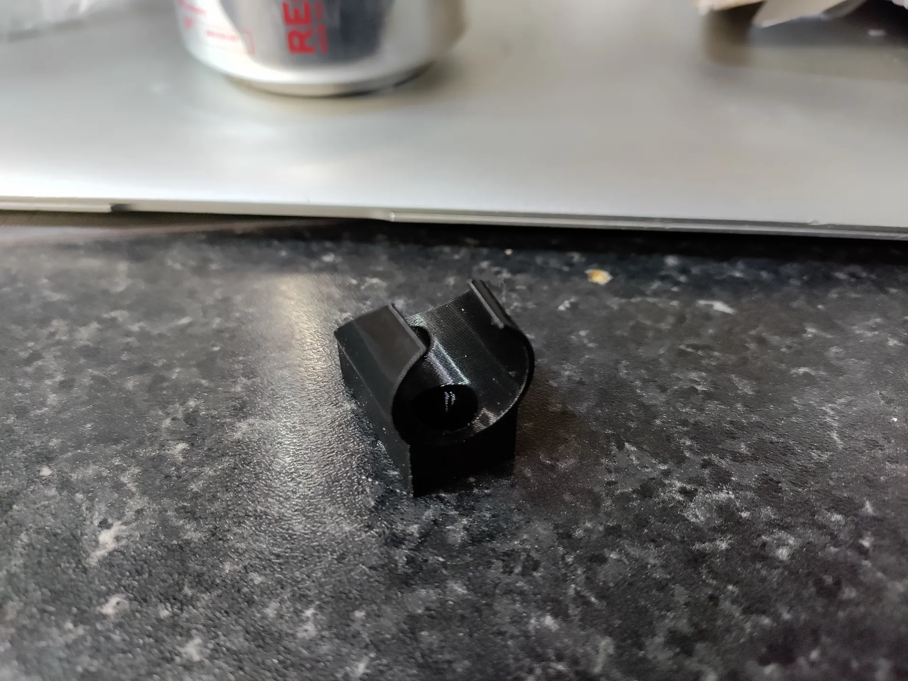
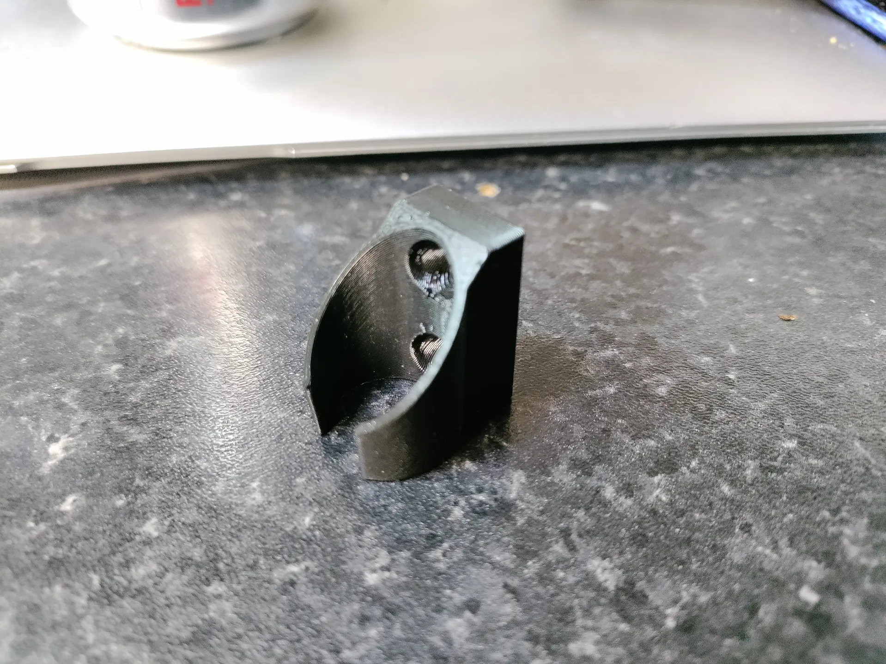

# Pica Dry Pencil Wall Mount

[![CC BY-NC-SA 4.0][cc-by-nc-sa-image]][cc-by-nc-sa]

This is a remix of the really nice model made by [@GHPMDESIGN_253104](https://www.printables.com/@GHPMDESIGN_253104) here:  https://www.printables.com/model/510398-skadis-pica-penmarker-holder

The original design linked above is really nice because you can put the pencil in from the top and it will orientate the pencil as it slides in.  Also you can remove the pencil by pulling from the bottom or lifting from the top.

I remixed because I needed it to be wall mountable, so I slapped on a backing plate and screw holes, and here is the remix.  The real credit goes to the original author.

To attach to the wall simply use two 3mm or 4mm wood screws.  Make sure the heads of the screws sit below the tube area so that they do not interfere with the pencil when inserting or removing.
 

## Print Options

- PLA
- 2mm layer
- 3 walls
- 20% infill
- no support
- no brim

Used about 3g of filament or 1m of 1.75mm of filament.  These settings might be overkill.

## Print Orientation

## 3D Model

## More Pictures

This work is licensed under a
[Creative Commons Attribution-NonCommercial-ShareAlike 4.0 International License][cc-by-nc-sa].

[![CC BY-NC-SA 4.0][cc-by-nc-sa-image]][cc-by-nc-sa]

[cc-by-nc-sa]: http://creativecommons.org/licenses/by-nc-sa/4.0/
[cc-by-nc-sa-image]: https://licensebuttons.net/l/by-nc-sa/4.0/88x31.png
[cc-by-nc-sa-shield]: https://img.shields.io/badge/License-CC%20BY--NC--SA%204.0-lightgrey.svg
